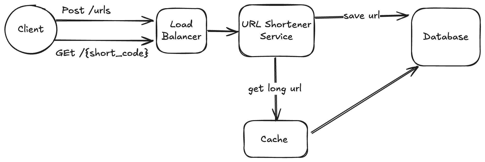

= URL SHORTENER
 :author: Ahmed

 A url shortener is a service that converts long URL to a short version.

== Requirements

1. Users should be able to submit a long URL and receive a short version.
2. Users should be able to specify an optional expiration date or custom alias.
3. Users should be able to access the original URL by using the shortened version.

=== Core Entities
- Original URL
- Short URL
- User

== API Endpoints

=== POST /urls
Shorten a long URL.

==== Request
[source,json]
----
{
  "long_url": "https://www.example.com/some/very/long/url",
  "expiration_date": "optional_expiration_date"
}
----

==== Response
[source,json]
----
{
  "short_url": "http://short.ly/abc123"
}
----

=== GET /{short_code}
Shorten a long URL.

==== Response
[source,json]
----
{
  "short_url": "http://short.ly/abc123"
}
----

== High-Level Architecture

== Data Model

